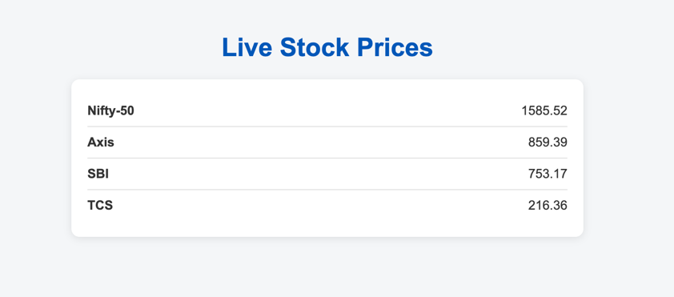

# Stock Consumer Service

A Spring Boot application for consuming stock price updates from Kafka and streaming live prices to clients using WebFlux.

## Features

- Consumes stock price data from Kafka.
- Broadcasts live stock prices to clients via a reactive REST endpoint.
- Simple web UI to display live stock prices.


## Tech Stack

- Java 17
- Spring Boot 3.5.x
- Spring WebFlux
- Kafka
- Maven

## Getting Started

### Prerequisites

- Java 17+
- Maven
- Kafka broker running
- stock_producer_service running

### Setup  
 - Setup kafka cluster and create the `stock-prices` topic.
    - Refer to [Kafka Setup Guide](setup_kafka.md) for detailed instructions. 
 - Clone the repository: [stock_producer_service](https://github.com/anjit07/stock_producer_service.git)
- Follow the instructions in the `README.md` of the stock_producer_service to run it.
- Build and run this service.

## How to Run
1. Build the project:
   ```sh
   ./mvnw clean install
   ```
2. Run the application:
   ```sh
   ./mvnw spring-boot:run
   
## See live stock prices
   Open your browser and go to: [http://localhost:8081](http://localhost:8081)
   